# Установка Xubuntu 24.04 LTS в VMware Workstation Pro

Руководство по настройке Linux-окружения для фронтенд-разработки.

---

## 1. Выбор дистрибутива Linux

Ubuntu 24.04 с GNOME слишком тяжёлая для виртуальной машины (потребляет ~1.5-2 ГБ RAM в простое). Лёгкие альтернативы:

| Дистрибутив | RAM | Комментарий |
|---|---|---|
| **Xubuntu** | 2 ГБ | Ubuntu + лёгкий XFCE, те же пакеты |
| **Lubuntu** | 1-2 ГБ | Ubuntu + очень лёгкий LXQt |
| **Linux Mint XFCE** | 2 ГБ | Дружелюбный, похож на Windows |
| **Debian 12 + XFCE** | 1-2 ГБ | Стабильный, минимальный |

**Выбор: Xubuntu 24.04 LTS** — та же Ubuntu, только с лёгким рабочим столом XFCE (~500-700 МБ RAM в простое). Полная совместимость с Ubuntu: apt, PPA, все пакеты. VS Code, Node.js, Git, Docker — всё работает без проблем.

**Почему 24.04, а не 25.10:** 24.04 — это LTS (Long Term Support), поддержка до 2027 года. 25.10 — промежуточный релиз с поддержкой всего 9 месяцев.

---

## 2. Выбор виртуальной машины: VMware vs VirtualBox

| | VMware Workstation Pro | VirtualBox |
|---|---|---|
| **Цена** | Бесплатно (с 2024) | Бесплатно |
| **Производительность** | Лучше | Хуже |
| **3D-графика** | Лучше поддержка | Хуже, бывают артефакты |
| **Общий буфер обмена** | Работает стабильно | Иногда отваливается |
| **Drag & drop файлов** | Работает хорошо | Бывают проблемы |
| **Снапшоты** | Есть (в Pro) | Есть |

**Выбор: VMware Workstation Pro** — бесплатный (раньше стоил ~$200), производительнее VirtualBox.

### Ссылки для скачивания

- **VMware Workstation Pro:** [Broadcom Support Portal](https://knowledge.broadcom.com/external/article/344595/downloading-and-installing-vmware-workst.html) (нужна бесплатная регистрация)
- **VirtualBox:** [virtualbox.org/wiki/Downloads](https://www.virtualbox.org/wiki/Downloads)
- **Xubuntu 24.04:** [xubuntu.org/download](https://xubuntu.org/download/) — выбрать Desktop, 64-bit

---

## 3. Рекомендуемые настройки VMware для Xubuntu 24.04

| Параметр | Значение | Комментарий |
|---|---|---|
| **Memory (RAM)** | 8 ГБ (8192 МБ) | Минимум 4 ГБ, для VS Code + браузер + Node.js лучше 8 |
| **Processors** | 4 ядра (2 процессора x 2 ядра) | Минимум 2, но 4 заметно комфортнее |
| **Hard Disk** | 60 ГБ, NVMe, single file | Не выделять сразу — диск растёт по мере заполнения |
| **Network** | NAT | Интернет из коробки |
| **USB Controller** | USB 3.1 | По умолчанию |
| **3D Graphics** | Включить | Accelerate 3D graphics |
| **Graphics Memory** | 2 ГБ (2048 МБ) | Для плавности интерфейса |

### Сколько RAM оставить хосту (Windows)

- 16 ГБ на хосте → выдели VM 6 ГБ
- 32 ГБ на хосте → выдели VM 8-12 ГБ

---

## 4. Пошаговая установка

### Шаг 1. New Virtual Machine Wizard

Выбираем **Custom (advanced)** — для ручной настройки всех параметров.

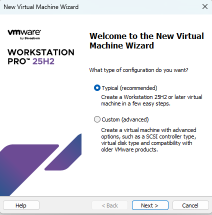

### Шаг 2. Hardware Compatibility

Оставляем **Workstation 25H2 or later** (по умолчанию).

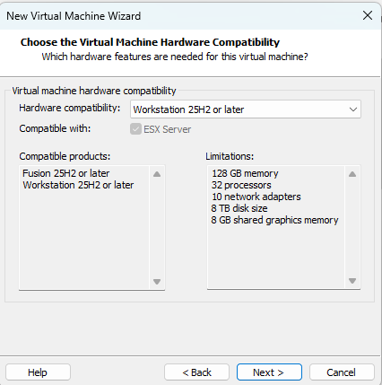

### Шаг 3. Easy Install Information

Заполняем данные для входа в Linux:
- **Full name:** имя (например, Xubuntu-24.04)
- **User name:** логин (маленькими буквами, без пробелов, например `alex`)
- **Password:** пароль для системы и sudo

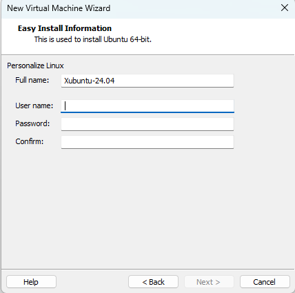

### Шаг 4. I/O Controller Types

Оставляем **LSI Logic (Recommended)**.

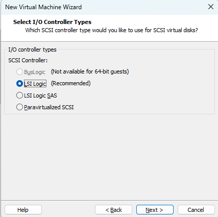

### Шаг 5. Select a Disk Type

Выбираем **NVMe** — самый быстрый тип диска.

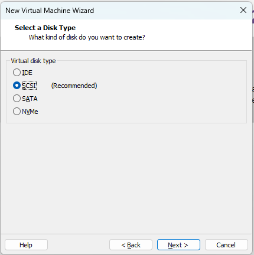

### Шаг 6. Select a Disk

Выбираем **Create a new virtual disk**.

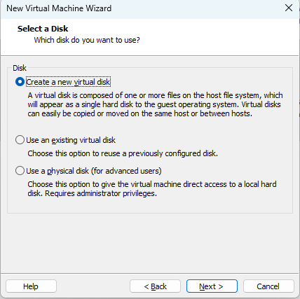

### Шаг 7. Specify Disk Capacity

- **Maximum disk size:** 60 ГБ (20 ГБ мало — node_modules быстро съедят)
- **Store virtual disk as a single file** — работает быстрее
- **Allocate all disk space now** — НЕ ставить галочку

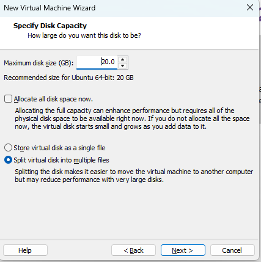

### Шаг 8. Ready to Create Virtual Machine

Проверяем итоговые настройки. Через **Customize Hardware** нужно:
1. Проверить размер диска (60 ГБ)
2. Включить **Accelerate 3D graphics** в Display
3. Поставить Graphics Memory на **2 ГБ**

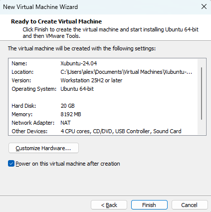

### Шаг 9. Информационное сообщение — Side Channel Mitigations

Просто информация о защите от уязвимостей процессора. Ставим "Do not show this hint again" → **OK**.

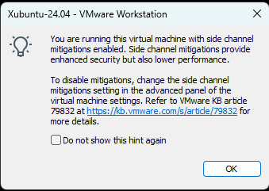

### Шаг 10. Информационное сообщение — Removable Devices

Информация о подключении USB-устройств. Ставим "Do not show this hint again" → **OK**.

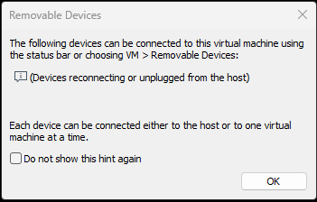

### Шаг 11. Загрузка Xubuntu

Xubuntu загрузилась в live-режиме. Кликаем на иконку **"Install Xubuntu"** на рабочем столе.

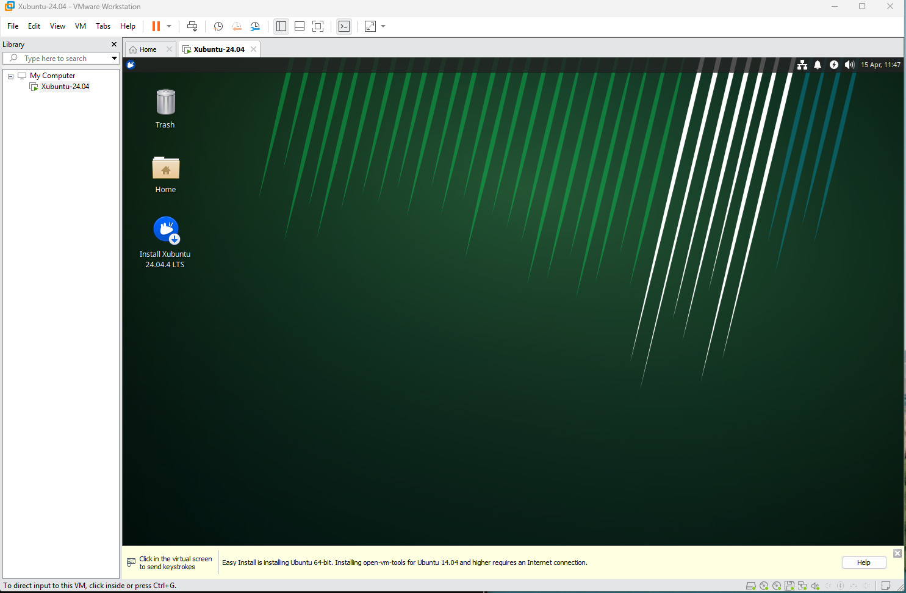

### Шаг 12. Тип установки

Выбираем **Interactive installation**.

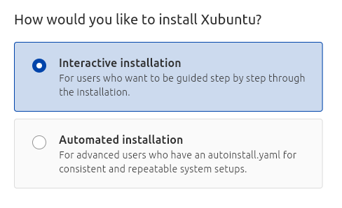

### Шаг 13. Выбор приложений

Выбираем **Xubuntu Desktop** (полная установка).

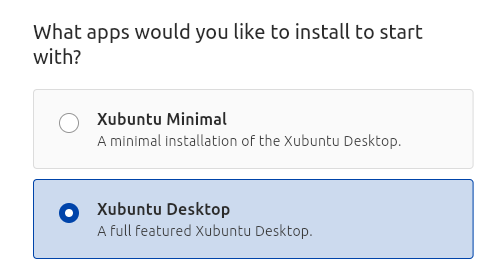

### Шаг 14. Проприетарное ПО

Ставим обе галочки:
- Install third-party software for graphics and Wi-Fi hardware
- Download and install support for additional media formats

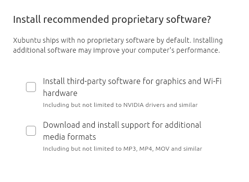

### Шаг 15. Разметка диска

Выбираем **Erase disk and install Xubuntu** (виртуальный диск — ничего не потеряется).

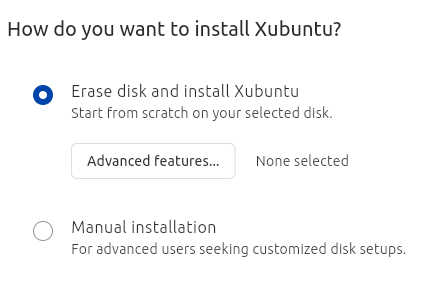

### Шаг 16. Создание учётной записи

- **Your name:** имя
- **Your computer's name:** например `xubuntu-dev`
- **Your username:** логин (маленькими буквами)
- **Password:** пароль
- Галочка "Require my password to log in" — оставить

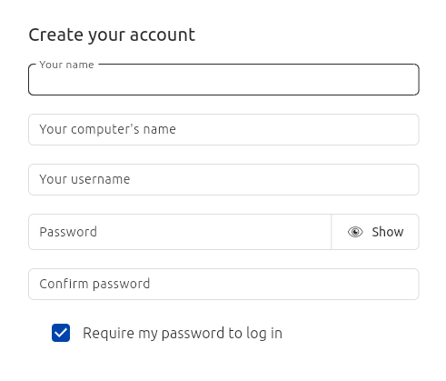

### Шаг 17. Установка завершена

Жмём **Restart now**. После перезагрузки входим с логином и паролем.

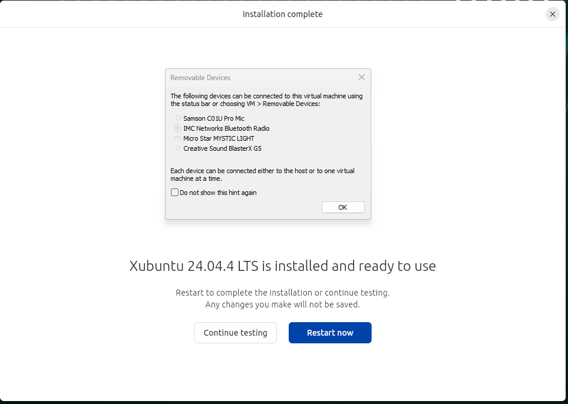

---

## 5. После установки — первые команды

```bash
# Обновить систему
sudo apt update && sudo apt upgrade -y

# Установить VMware Tools (если не установились автоматически)
sudo apt install open-vm-tools open-vm-tools-desktop -y

# Перезагрузить
sudo reboot
```

---

## 6. Установка инструментов для фронтенд-разработки

```bash
# VS Code
sudo apt install wget gpg -y
wget -qO- https://packages.microsoft.com/keys/microsoft.asc | gpg --dearmor > packages.microsoft.gpg
sudo install -D -o root -g root -m 644 packages.microsoft.gpg /etc/apt/keyrings/packages.microsoft.gpg
echo "deb [arch=amd64 signed-by=/etc/apt/keyrings/packages.microsoft.gpg] https://packages.microsoft.com/repos/code stable main" | sudo tee /etc/apt/sources.list.d/vscode.list
sudo apt update && sudo apt install code -y

# Node.js (через nvm)
curl -o- https://raw.githubusercontent.com/nvm-sh/nvm/v0.40.1/install.sh | bash
source ~/.bashrc
nvm install --lts

# Git
sudo apt install git -y
git config --global user.name "Your Name"
git config --global user.email "your@email.com"

# Google Chrome
wget https://dl.google.com/linux/direct/google-chrome-stable_current_amd64.deb
sudo dpkg -i google-chrome-stable_current_amd64.deb
sudo apt -f install -y
```
